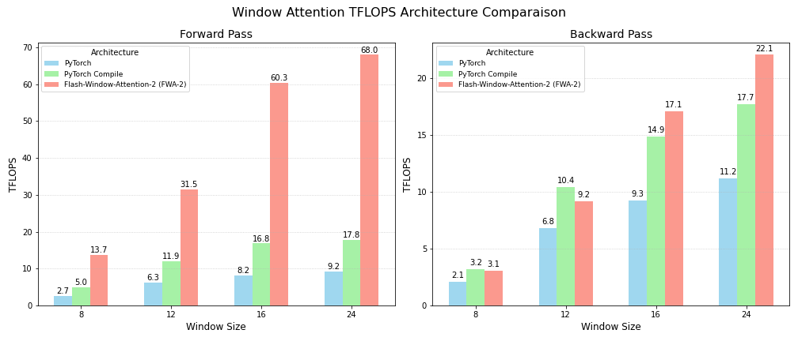

# Flash Window Attention V2: Accelerating Swin Transformer V2

**Flash Window Attention V2** (FWA-2) is a triton implementation of the scaled cosine attention occuring in the Swin transformer V2 attention mechanism. his implementation builds upon the principles introduced in the original [Flash Attention-2 paper](https://arxiv.org/abs/2307.08691), specifically adapting them for the unique requirements of Scaled Cosine (Window) Attention.

This graph provides a clear comparison of computational throughput (TFLOPS) for different implementations of window attention across varying window sizes, and with the following configuration:  batch_size=16, num_windows=16, num_heads=6 and head_dim=32.

## Features

The [Swin transformer V2](https://arxiv.org/abs/2111.09883) is a powerful architecture, but its attention mechanism can be a bottleneck in terms of speed and memory, specially with increasing patch size and window size. By leveraging Triton, FWA-2 significantly improves performance by:

- 📊 **Reducing memory comsuption:** Following the Flash Attention paradigm, costly reads and writes to global GPU memory are minimized, mainly in the backward pass, where the memory usage is reduced by a factor of 2.
- ⚡ **Significant Forward and Backward Speedup:** Directly translates to higher throughput for image processing during both training and inference, achieving faster processing for your current models or, alternatively, train and deploy more complex and powerful models while maintaining previous throughput levels.

The reduced memory footprint and the faster inference speed allows for training and deploying larger models or using bigger batch sizes, pushing the boundaries of what's possible on current hardware.

This repository offers a comprehensive and highly optimized implementation of the **scaled cosine attention mechanism** for Swin Transformer V2, implemented entirely using Triton GPU kernels. Key features include:

* **Q and K Normalization:** Ensures stable training and performance.
* **Bias & Masking:** Supports various attention bias configurations and orrectly handles attention masks for windowed attention.
* **Differentiable Logit Scale:** Addresses the unique scaling factor of Swin Transformer V2 by enabling logit scale backward pass.
* **Flexible Dimensions:** Our kernels are designed to be highly versatile, working seamlessly with any sequence length (i.e. window size) and any head dimension of at least 16.
* **High Numerical Precision:** The implementation maintains very low error compared to the classic PyTorch window attention, and retains the same error level as what you'd expect from `torch.compile` optimizations.
* **Mixed Precision Support:** The kernels efficiently operate in both float16 and bfloat16, enabling faster computation and reduced memory usage on compatible hardware.

## Performance

Benchmarks comparing this Flash Window Attention V2 implementation against the classic PyTorch window attention for both forward and backward passes have been conducted on a H100 96GB GPU. To ensure consistent comparison with an image size of 256, two configurations are evaluated while maintaining a constant product of Patch Size (P) and Window Size (W) at 32 ($P \times W = 32$). These configurations are: patch=4 / window=8, and patch=2 / window=16. The second configuration inherently involves a four-fold increase in tokens & sequence length per window, making it significantly more compute-intensive. The results demonstrate significant improvements in both execution time and memory efficiency.

### Patch Size = 4 / Window Size = 8
Even in the most classic and tiniest configuration of the Swin Transformer, FWA-2 outperforms the standart implementation.

* **Forward Pass:** FWA-2 consistently outperforms the classic implementation in terms of speed, with the performance gap widening as the batch size increases. Memory usage is also notably lower, providing efficiency gains.
* **Backward Pass:** The benefits are even more pronounced in the backward pass. FWA-2 delivers minor speedups and significant memory reductions, which are crucial for training large models.

### Patch Size = 2 / Window Size = 16

The benefits of Flash Window Attention V2 become significantly more apparent when increasing computational load, as demonstrated by the performance results in this configuration.

* **Forward Pass:** Similar to the previous configuration, FWA-2 shows clear advantages in execution time and memory usage. The absolute times and memory consumptions are higher due to the larger window size, but the relative improvements from Flash Attention remain strong.
* **Backward Pass:** The memory savings are particularly striking with the larger window size. At batch size 64, Flash Attention's backward pass requires only 15.57GB of memory, a significant reduction compared to Classic Attention's 32.63GB. This highlights Flash Attention's capability to unlock training for larger models and batch sizes that would otherwise be memory-prohibitive.

These benchmarks clearly demonstrate that Flash Window Attention V2 consistently outperforms the PyTorch implementation across various configurations. For compute-heavy scenarios, such as the patch=2 / window=16 configuration, FWA-2 can yield significant improvements, including **over a 2x improvement in memory efficiency and runtime**. These optimizations are critical for efficiently training and deploying large-scale Swin Transformer V2 models.

## Requirements

- Python
- PyTorch
- Triton